# 前端书籍

dva 首先是一个基于 [redux](https://github.com/reduxjs/redux) 和 [redux-saga](https://github.com/redux-saga/redux-saga) 的数据流方案，然后为了简化开发体验，dva 还额外内置了 [react-router](https://github.com/ReactTraining/react-router) 和 [fetch](https://github.com/github/fetch)，所以也可以理解为一个轻量级的应用框架。

## JavaScript 的必看的经典书籍

- **《JavaScript 高级程序设计》（第四版）** 传说中的红宝书

  

  > PDF 文件下载链接: [https://pan.baidu.com/s/1Rx9N8xyX7hNbEIezeQz_GQ](https://pan.baidu.com/s/1Rx9N8xyX7hNbEIezeQz_GQ) &nbsp;&nbsp; 提取码: **i47r**

* **《JavaScript 权威指南》 （第六版）** 传说中的 js 圣经

  

  > PDF 文件下载链接: [https://pan.baidu.com/s/1FYua8MG-3rhqJ0IwP34MoA](https://pan.baidu.com/s/1FYua8MG-3rhqJ0IwP34MoA) &nbsp;&nbsp; 提取码: **arbt**

* **《你不知道的 JavaScript》（上卷）** 小黄书 1

  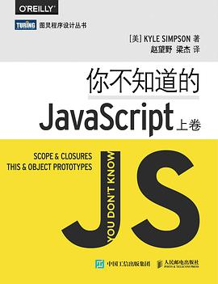

  > PDF 文件下载链接: [https://pan.baidu.com/s/1mPVRBY9m-HV8da1H-KYH1A](https://pan.baidu.com/s/1mPVRBY9m-HV8da1H-KYH1A) &nbsp;&nbsp; 提取码: **pyer**

* **《你不知道的 JavaScript》（中卷）** 小黄书 2

  

  > PDF 文件下载链接: [https://pan.baidu.com/s/1Y7553bvryPOvNCBk9YVTDw](https://pan.baidu.com/s/1Y7553bvryPOvNCBk9YVTDw) &nbsp;&nbsp; 提取码: **dser**

* **《你不知道的 JavaScript》（下卷）** 小黄书 3

  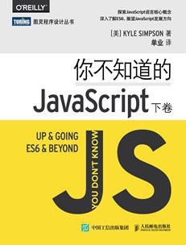

  > PDF 文件下载链接: [https://pan.baidu.com/s/1FYua8MG-3rhqJ0IwP34MoA](https://pan.baidu.com/s/1FYua8MG-3rhqJ0IwP34MoA) &nbsp;&nbsp; 提取码: **arbt**

* **《JavaScript 语言精髓》**

  

  > PDF 文件下载链接: [https://pan.baidu.com/s/1FYua8MG-3rhqJ0IwP34MoA](https://pan.baidu.com/s/1FYua8MG-3rhqJ0IwP34MoA) &nbsp;&nbsp; 提取码: **arbt**

* **《ES6 标准入门》**

  

  > PDF 文件下载链接: [https://pan.baidu.com/s/1FYua8MG-3rhqJ0IwP34MoA](https://pan.baidu.com/s/1FYua8MG-3rhqJ0IwP34MoA) &nbsp;&nbsp; 提取码: **arbt**

* **《深入理解 ES6》**

  

  > PDF 文件下载链接: [https://pan.baidu.com/s/1x7iZobeweglpWEd_KQ7t0A](https://pan.baidu.com/s/1x7iZobeweglpWEd_KQ7t0A) &nbsp;&nbsp; 提取码: **12xb**

* **《JavaScript 设计模式与开发实践》**

  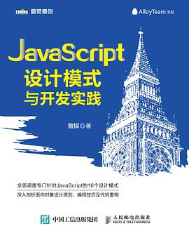

  > PDF 文档下载
  >
  > 链接: [https://pan.baidu.com/s/1LX1PuoMyUQ0giBaX_xD2sQ](https://pan.baidu.com/s/1LX1PuoMyUQ0giBaX_xD2sQ) &nbsp;&nbsp; 提取码: **cin5**

* **《Typescript 教程入门指南》**

  

> 线上阅读链接： [http://ts.xcatliu.com/](http://ts.xcatliu.com)
>
> PDF 文档下载：
>
> 链接: [https://pan.baidu.com/s/1Yt3JTVv2jfQjmPVFc22XbQ](https://pan.baidu.com/s/1Yt3JTVv2jfQjmPVFc22XbQ) &nbsp;&nbsp; 提取码: **vghm**

- **《Learning TypeScript 中文版》**

  

  > PDF 文件下载链接: [https://pan.baidu.com/s/1Z4-TtppBlxRFCy53BLTfYg](https://pan.baidu.com/s/1Z4-TtppBlxRFCy53BLTfYg) &nbsp;&nbsp; 提取码: **ipv2**

- **《数据结构与算法》 JavaScript 描述版**

  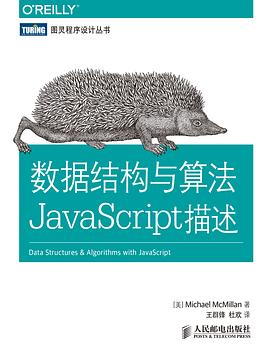

  > PDF 文件下载链接: [https://pan.baidu.com/s/1Fkj41FhcJowVZ3MIiz7A3Q](https://pan.baidu.com/s/1Fkj41FhcJowVZ3MIiz7A3Q) &nbsp;&nbsp; 提取码: **yqhn**

## HTML 与 CSS 的入门到放弃的书籍

- **《Head First HTML 与 CSS 第 2 版》**

  

  > PDF 文档下载链接：**[http://www.java1234.com/a/javabook/webbase/2016/0725/6452.html](http://www.java1234.com/a/javabook/webbase/2016/0725/6452.html)**

- **[图灵程序设计丛书].《响应式 Web 设计：HTML5 和 CSS3 实战》第 2 版**

  

  > PDF 文档下载链接： **[http://pan.baidu.com/s/1cByAT4](http://pan.baidu.com/s/1cByAT4) &nbsp;&nbsp; 密码：c6ox**

- **《CSS 权威指南》** 第四版

> PDF 文档下载链接：**[https://pan.baidu.com/s/1idTAxUyIIYkDjOiq8J0PsQ](https://pan.baidu.com/s/1idTAxUyIIYkDjOiq8J0PsQ)** &nbsp;&nbsp;
> 提取码：**6mzf**

- **《HTML5 与 CSS3 权威指南》**

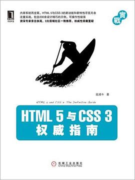

> PDF 文档下载链接: **[https://pan.baidu.com/s/16ou7W0ic0hiz8T-OjQA9mw](https://pan.baidu.com/s/16ou7W0ic0hiz8T-OjQA9mw)**
>
> 提取码: **fpej**

- 《图解 CSS》

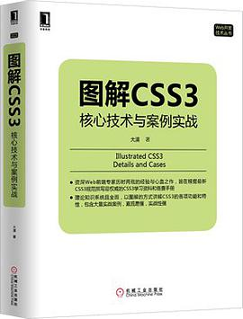

> PDF 文档下载链接：**[https://pan.baidu.com/s/1jGUpKb0](https://pan.baidu.com/s/1jGUpKb0)**

## 前端框架 Vue 与 React 深入学习书籍

- **《Vue.js 权威指南》**

> PDF 文档下载链接: **[https://pan.baidu.com/s/1iYnj8SwdKmDHaWgouVWivA](https://pan.baidu.com/s/1iYnj8SwdKmDHaWgouVWivA)**
> 密码：**nnao**

- **《Vue.js 实战》**

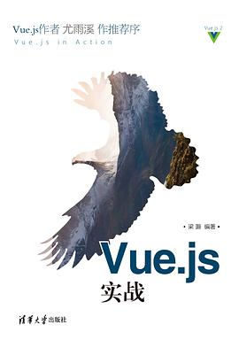

> PDF 文档下载：
>
> **链接：[https://www.jb51.net/books/612751.html](https://www.jb51.net/books/612751.html)**

- **《React 全栈》** React 全栈：Redux+Flux+webpack+Babel 整合开发

> **链接：[https://pan.baidu.com/s/1IjiWcsktJzp94P0Eo7OHoA](https://pan.baidu.com/s/1IjiWcsktJzp94P0Eo7OHoA)** &nbsp;&nbsp; **提取码：wsss**

- **《深入 React 技术栈》**

> PDF 文档下载：
>
> **链接：[https://pan.baidu.com/s/1541DmSWVVrq68iCiifv0mQ](https://pan.baidu.com/s/1541DmSWVVrq68iCiifv0mQ)** &nbsp;&nbsp; **提取码：i6do**

## 后端与数据库学习

- **《Node.js 权威指南》**

> **链接: [https://pan.baidu.com/s/1OWRyGWupgW2gkD1BghdxLw](https://pan.baidu.com/s/1OWRyGWupgW2gkD1BghdxLw)**
>
> **提取码: 64iz**

- **《深入浅出 Node.js》**

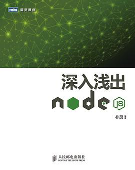

> PDF 文档下载：
>
> **链接: [https://pan.baidu.com/s/1QdA8hfTl_th0OYHX3_CbWg](https://pan.baidu.com/s/1QdA8hfTl_th0OYHX3_CbWg)**
>
> **提取码: m5sj**

- **《了不起的 Node.js》**

> PDF 文档下载：
>
> **链接：[https://pan.baidu.com/s/1eRTb6gy](https://pan.baidu.com/s/1eRTb6gy)**

- **《Node.js 实战》**

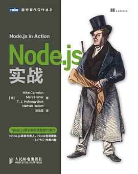

> PDF 文档下载：
>
> **链接: [https://pan.baidu.com/s/1LeTIugTp8MTWufdJzckxZw](https://pan.baidu.com/s/1LeTIugTp8MTWufdJzckxZw)**
>
> **提取码: ab7t**

- 《MongoDB 权威指南》第二版

> PDF 文档下载
>
> **链接：[http://www.downcc.com/soft/301857.html](http://www.downcc.com/soft/301857.html)**

- 《MongoDB 实战》

> PDF 文档下载：
>
> **链接：[https://www.jb51.net/books/610176.html](https://www.jb51.net/books/610176.html)**
>
> **或者：[https://6so.so/t/407599/](https://6so.so/t/407599/)**

## 网络与性能优化相关书籍

- 《图解 HTTP》

> PDF 文档下载
>
> **链接: [https://pan.baidu.com/s/16HN0W_7g4HNKIILuXOx7fg](https://pan.baidu.com/s/16HN0W_7g4HNKIILuXOx7fg)**
>
> **提取码: km23**

- **《HTTP 权威指南》**

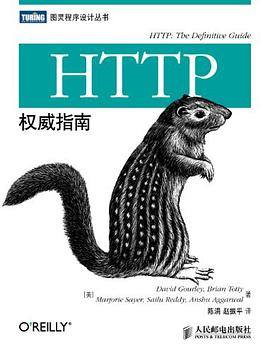

> PDF 文档下载：
>
> **链接: [https://pan.baidu.com/s/1hXn5Pbyr2cetH8F0rrVjuw](https://pan.baidu.com/s/1hXn5Pbyr2cetH8F0rrVjuw)**
>
> **提取码: khap**

- 《高性能网站建设进阶指南》前端工程师精髓

> PDF 文档下载：
>
> **链接: [https://pan.baidu.com/s/1IEsG5Ip_JDODyTSDm81W7w](https://pan.baidu.com/s/1IEsG5Ip_JDODyTSDm81W7w)**
>
> **提取码: nadd**

- **《Web 性能权威指南》**

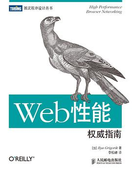

> PDF 文档下载
>
> **链接: [https://pan.baidu.com/s/1o2hOTqQVIz5IqaU3YlCdjA](https://pan.baidu.com/s/1o2hOTqQVIz5IqaU3YlCdjA)**
>
> **提取码: nbva**

## 前端工程化所需要读的书籍

- **[图灵程序设计丛书].《GitHub 入门与实践》**

 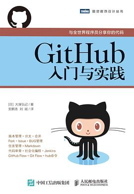

工作中 Git 常用命令：[https://github.com/ZhengMaster2020/blogs/issues/5](https://github.com/ZhengMaster2020/blogs/issues/5)

> PDF 文档下载：
>
> 链接: [https://pan.baidu.com/s/1HC0Ee9tqTpzx7kBS_zhwXQ](https://pan.baidu.com/s/1HC0Ee9tqTpzx7kBS_zhwXQ)
>
> 提取码: **cyvs**

- **《GitHub 入门与实践》**

 

> 在线文档浏览：
>
> 链接 1: [https://gitee.com/progit/](https://gitee.com/progit/)
>
> 链接 2: [https://git-scm.com/book/zh/v2](https://git-scm.com/book/zh/v2)

- 《深入浅出 webpack》

 

> PDF 文档下载
>
> :link: 链接: [https://pan.baidu.com/s/1Ezdr4ycSZVO8duZYVMjtdQ](https://pan.baidu.com/s/1Ezdr4ycSZVO8duZYVMjtdQ)
>
> :thought_balloon:提取码: **hdmr**

持续更新中。。。

---

温馨提示:tipping_hand_man: ：本文所有书籍均来源于网络，本篇内容不存在任何非法传播盗版书籍，

如若有侵权请发邮件:e-mail: ：2105195274@qq.com

Github:ghost: : **https://github.com/ZhengMaster2020/FEBooks**

我会及时删除侵权内容。:pray: **欢迎 star** :star:

