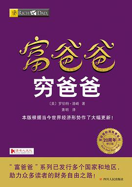

# 其他圈层的书籍

## 个人成长

- 《非暴力沟通》

- 《关键对话》

- 《格局》

## 哲学社科

- 《人类简史》

- 《人体简史》

- 《时间简史》

* 《未来简史》

- 《认知觉醒》

- 《自控力》

- 《娱乐至死》

- 《少有人走的路》 心智成熟的旅程

- 《失控》

## 经济理财

- 《穷爸爸与富爸爸》

<!--  -->

- 《价值》

- 《穷查理宝典》

- 《财务自由之路》

- 《解读基金： 我的投资价值观与实践》

- 《小狗钱钱》

- 《巴菲特致股东的信》

- 《聪明的投资者》

- 《证券分析》

- 《彼得·林奇的成功投资》

- 《战胜华尔街》

- 《逆向投资策略》

- 《新逆向投资策略》