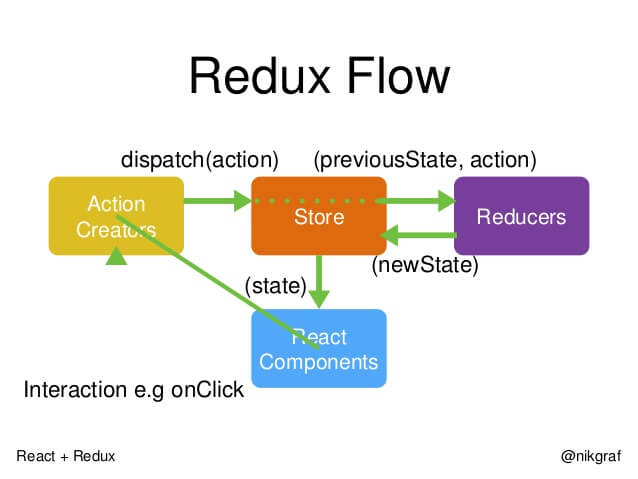
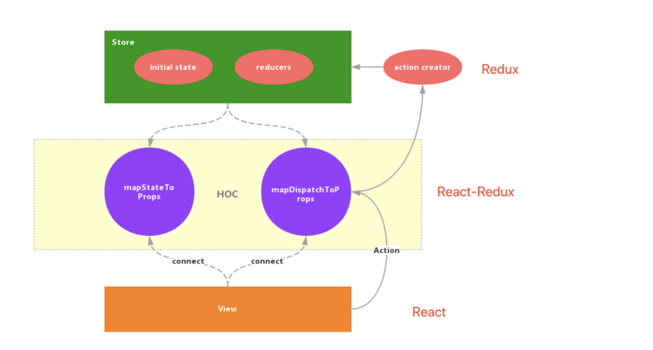

# Redux 的入门学习

::: tip where 学习网站
中文官网：[https://www.redux.org.cn/](https://www.redux.org.cn/)

阮一峰：[http://www.ruanyifeng.com/blog/2016/09/](http://www.ruanyifeng.com/blog/2016/09/redux_tutorial_part_one_basic_usages.html)

英文官网：[https://redux.js.org/](https://redux.js.org/)

练手项目：[https://github.com/bailicangdu/react-pxq](https://github.com/bailicangdu/react-pxq)

:::


## 什么是 redux

Redux 就是用来进行可预期状态管理的一个 JavaScript 状态容器。


## React 与 redux 的关系

React 使用 Redux 进行状态管理， React 可不不使用 Redux，Redux 也不是仅仅提供给 React 使用。


## Redux 的几个重要概念

- Store

- Action

- Reducer

- State




## React 中如何使用 redux

- 引入
- 创建
- 分发 action
- reducer 接受 Action
- 订阅 state


## Redux 与 react-redux 的关系

ReactRedux 是在 Redux 的基础上进行了一层更加便利 React 调用 Redux 的逻辑层的封装


## React 中如何使用 react-redux



## Redux 的异步操作与 Middleware

+ Redux-saga
+ middleware


## 状态管理工具

- Redux、React-Redux / Dva
- Mobox
- React Context 、useReducer
- Recoil


## 什么时候需要 rudux？

**不需要:**

简单说，如果你的 UI 层非常简单，没有很多互动，Redux 就是不必要的，用了反而增加复杂性。

- 用户的使用方式非常简单

- 用户之间没有协作

- 不需要与服务器大量交互，也没有使用 WebSocket

- 视图层（View）只从单一来源获取数据

**需要：**

- 用户的使用方式复杂的角度来看， Redux 的适用场景是**多交互、多数据源**

  - 不同身份的用户有不同的使用方式（比如普通用户和管理员）
  - 多个用户之间可以协作
  - 与服务器大量交互，或者使用了 WebSocket
  - View 要从多个来源获取数据

- 从组件角度看，如果你的应用有以下场景，可以考虑使用 Redux。

  - 某个组件的状态，需要共享
  - 某个状态需要在任何地方都可以拿到
- 一个组件需要改变全局状态
  - 一个组件需要改变另一个组件的状态

  

## 使用 Redux 技术栈进行Demo实战

+ 第一步：使用yarn和create-react-app创建一个react应用，并运行项目

  ```shell
  yarn create react-app todo-list
  
  cd todo-list
  
  yarn start
  ```

+ 删掉`src`文件夹下的相关文件，只保留`App.js`、`App.css`以及`index.js`文件，并删掉这两个文件的相关应用

+ 安装`redux`依赖包

  ```shell
  yarn add redux ant-design
  ```

+ 在`src`目录下创建``components`文件夹，并在`components`目录下常见`Counter`组件

  ```shell
  cd src 
  mkdir components
  cd components && mkdir Counter 
  cd Counter && touch index.js
  ```

+ 在`Counter`目录下的`index.js`实现相应的组件逻辑，实现一个简单的加减乘除计算器

  ```react
  // App.js
  import Counter from './components/Count'
  import 'antd/dist/antd.css'
  import './App.css'
  const App = () => {
    return (
      <div className='App'>
        <Counter />
      </div>
    )
  }
  
  export default App
  
  ```

  ```css
  // App.css
  .App {
    display: flex;
    align-items: center;
    justify-content: center;
    padding-top: 100px;
  }
  
  .counter {
    width: 80vw;
    display: flex;
    flex-direction: column;
    align-items: center;
    justify-content: center;
  }
  
  .title {
    margin-bottom: 20px;
  }
  
  ```

  ```react
  // Counter
  import { Form, Button, InputNumber, Select } from 'antd'
  import { useState } from 'react'
  
  const Counter = () => {
    const [form] = Form.useForm()
    const [count, setCount] = useState(undefined)
    const onReset = () => {
      form.resetFields()
      setCount(() => undefined)
    }
  
    const onValuesChange = (changedValues, { symbol = 'add', firstNum = 0, secondNum = 0 }) => {
      switch (symbol) {
        case 'add':
          setCount(firstNum + secondNum)
          break
        case 'sub':
          setCount(firstNum - secondNum)
          break
        case 'mul':
          setCount(firstNum * secondNum)
          break
        case 'divi':
          setCount(firstNum / secondNum)
          break
        default:
          setCount(firstNum + secondNum)
          break
      }
    }
  
    return (
      <div className='counter'>
        <h3 className='title'> 简单计算器 </h3>
        <Form
          form={form}
          initialValues={{
            symbol: 'add',
          }}
          layout='inline'
          name='form'
          onValuesChange={onValuesChange}>
          <Form.Item name='firstNum'>
            <InputNumber />
          </Form.Item>
  
          <Form.Item name='symbol'>
            <Select>
              <Select.Option value='add'>+</Select.Option>
              <Select.Option value='sub'>-</Select.Option>
              <Select.Option value='mul'>*</Select.Option>
              <Select.Option value='divi'>/</Select.Option>
            </Select>
          </Form.Item>
  
          <Form.Item name='secondNum'>
            <InputNumber />
          </Form.Item>
  
          <Form.Item>
            <Button type='primary' size='small' onClick={onReset}>
              清空
            </Button>
          </Form.Item>
        </Form>
        <div style={{ marginTop: '30px', display: 'flex' }}>
          <h3 >结果是: {count} </h3>
        </div>
      </div>
    )
  }
  
  export default Counter
  
  ```

+ 到了这里我们已经实现的简单计算器的功能， 不过这个计算器的状态的是通过组件内容实用`hooks`的方式进行管理的，  接下来我们使用`redux`的技术栈对这个应用进行改造

+ 在`src`目录下新建`store.js`、`reducer.js`文件， 具体内容如下

  ```react
  // store.js
  import { createStore } from 'redux'
  
  import reducer from './reducer'
  
  export default createStore(reducer)
  
  ```

  ```react
  // reducer.js
  const initCountValue = 0
  const counterReducer = (preState, action) => {
    const { type, data } = action
    if (!data) return initCountValue
    const { firstNum = initCountValue, secondNum = initCountValue } = data
  
    switch (type) {
      case 'add':
        return firstNum + secondNum
      case 'sub':
        return firstNum - secondNum
      case 'mul':
        return firstNum * secondNum
      case 'divi':
        return (firstNum / secondNum).toFixed(2)
      default:
        return initCountValue
    }
  }
  
  export default counterReducer
  
  
  ```

  ```react
  // Counter.js
  import { Form, Button, InputNumber, Select } from 'antd'
  // import { useState } from 'react'
  import store from '../../redux/store'
  
  const Counter = () => {
    const [form] = Form.useForm()
    // const [count, setCount] = useState(undefined)
    const onReset = () => {
      form.resetFields()
      // setCount(() => undefined)
      store.dispatch({ type: 'init', data: 0 })
    }
  
    const onValuesChange = (cv, { symbol = 'add', firstNum = 0, secondNum = 0 }) => {
      const action = { type: symbol, data: { firstNum, secondNum } }
      store.dispatch(action)
      // switch (symbol) {
      //   case 'add':
      //     setCount(firstNum + secondNum)
      //     break
      //   case 'sub':
      //     setCount(firstNum - secondNum)
      //     break
      //   case 'mul':
      //     setCount(firstNum * secondNum)
      //     break
      //   case 'divi':
      //     setCount(firstNum / secondNum)
      //     break
      //   default:
      //     setCount(firstNum + secondNum)
      //     break
      // }
    }
  
    return (
      <div className='counter'>
        <h3 className='title'> 简单计算器 </h3>
        <Form
          form={form}
          initialValues={{
            symbol: 'add',
          }}
          layout='inline'
          name='form'
          onValuesChange={onValuesChange}>
          <Form.Item name='firstNum'>
            <InputNumber />
          </Form.Item>
  
          <Form.Item name='symbol'>
            <Select>
              <Select.Option value='add'>+</Select.Option>
              <Select.Option value='sub'>-</Select.Option>
              <Select.Option value='mul'>*</Select.Option>
              <Select.Option value='divi'>/</Select.Option>
            </Select>
          </Form.Item>
  
          <Form.Item name='secondNum'>
            <InputNumber />
          </Form.Item>
  
          <Form.Item>
            <Button type='primary' size='small' onClick={onReset}>
              清空
            </Button>
          </Form.Item>
        </Form>
        <div style={{ marginTop: '30px', display: 'flex' }}>
          <h3>结果是: {store.getState()} </h3>
        </div>
      </div>
    )
  }
  
  export default Counter
  
  
  ```

  ```react
  // index.js
  import React from 'react'
  import ReactDOM from 'react-dom'
  import App from './App'
  import store from './redux/store'
  
  const render = () =>
    ReactDOM.render(
      <React.StrictMode>
        <App />
      </React.StrictMode>,
      document.getElementById('root')
    )
  
  render()
  // store的的state值发生改变，更新试图
  store.subscribe(render)
  
  ```

  

## 参考文章

- [聊聊 React 两个状态管理库 Redux & Recoil](https://segmentfault.com/a/1190000023718977)

- [:green_heart: 美团技术团队：Redux 从设计到源码](https://tech.meituan.com/2017/07/14/redux-design-code.html)

- [除 Redux 外，目前还有哪些状态管理解决方案](https://www.zhihu.com/question/63726609)
